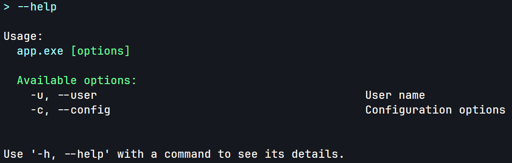
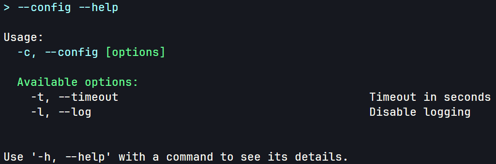

# NestedArguments

- [← Back to Overview](../Overview.md)

## Table of Contents

- [NestedArguments](#nestedarguments)
	- [Table of Contents](#table-of-contents)
	- [Overview](#overview)
	- [How It Works](#how-it-works)
	- [Example:](#example)
			- [Usage 1:](#usage-1)
			- [Usage 2:](#usage-2)

## Overview

Nested arguments allow you to structure your command-line options into hierarchical groups. This is particularly useful for applications with complex configurations where related settings are bundled together.

```md
Root
   ├─── --version
   ├─── --verbose
   └─── init (nested argument)
   │       ├─── --url
   │   	   └─── --output-folder
   │   
   └─── save (nested argument)
		   ├─── --display-result
	  	   └─── --new-folder
```

## How It Works

When parsing command-line arguments, the EasyArguments framework inspects each property of your arguments class. For properties that are reference types (other than `string`) and decorated with the `[Argument]` attribute, the parser treats them as nested arguments. This is determined if the property type is a class (excluding `string`).

The extraction process occurs recursively:

1. **Property Extraction:**  
   The `ExtractProperties` extension method reflects on the target type, gathering all public instance properties marked with `[Argument]`.
2. **Nested Binding:**  
   If a property is identified as a nested argument (i.e., its type is a class), `ExtractProperties` is called recursively on that type. The resulting child bindings are stored in the parent binding’s `Children` collection.
3. **Token Assignment:**  
   During parsing, tokens corresponding to nested arguments are assigned to their respective child properties. This enables the parser to correctly map command-line inputs to a multi-level object structure.
4. **Usage Generation:**  
   The framework also uses the nested structure to generate hierarchical help/usage text, making it easier for users to understand grouped options.

## Example:

In this example, a main argument class contains a nested configuration object. The nested class holds options specific to configuration settings.

```csharp
[ArgumentsController(Name = "app.exe")]
public class MyArguments
{
	[Argument("-u", "--user", "User name")]
	public string User { get; set; }

	[Argument("-c", "--config", "Configuration options")]
	public ConfigOptions Config { get; set; } = new ConfigOptions();
}

// Note that for nested classes, the ArgumentsController attribute is not required
// And in fact will be ignored
public class ConfigOptions
{
	[Argument("-t", "--timeout", "Timeout in seconds")]
	public int Timeout { get; set; }

	[Argument("-l", "--log", "Disable logging", InvertBoolean = true)]
	public bool EnableLogging { get; set; }
}
```

**Help display:**


**Nested Help display:**


#### Usage 1:

```bash
> -u "user name" --config 30 --log
```

**Output:**

```bash
Username: user name
Timeout: 30
Logging: False
```

---

#### Usage 2:

```bash
> -u="AAA" --config 1
```

**Output:**

```bash
Username: AAA
Timeout: 1
Logging: True
```

- [← Back to Overview](../Overview.md)