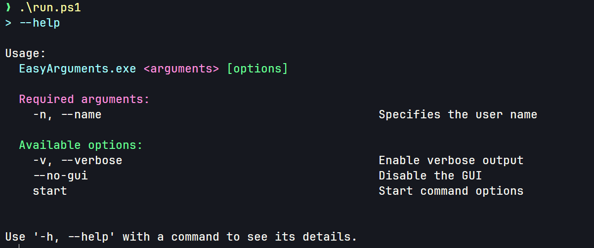
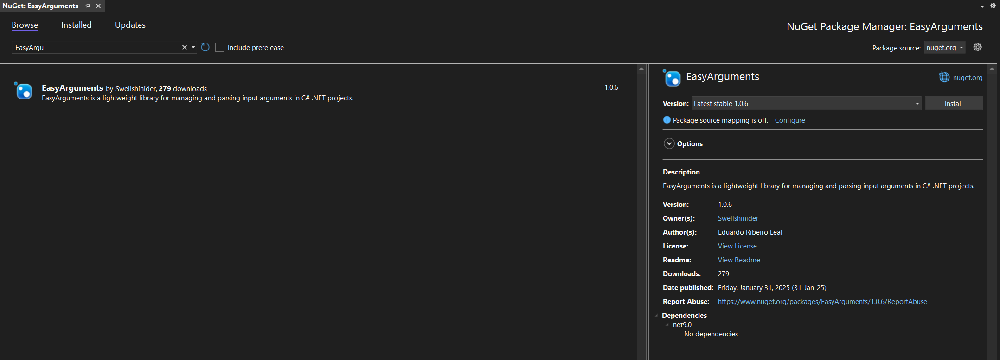

<div align="center">

# EasyArguments

[](https://github.com/swellshinider/EasyArguments/blob/main/LICENSE) [](https://www.nuget.org/packages/EasyArguments) [](https://www.nuget.org/packages/EasyArguments/) [](https://github.com/Swellshinider/EasyArguments/actions/workflows/dotnet-desktop.yml)

EasyArguments is a lightweight .NET library that simplifies the process of parsing command-line arguments into strongly-typed objects.



</div>

## Table of Contents

- [EasyArguments](#easyarguments)
  - [Table of Contents](#table-of-contents)
  - [About the project](#about-the-project)
    - [Key Features ✨](#key-features-)
    - [Why EasyArguments? 🚀](#why-easyarguments-)
  - [Installation 👌](#installation-)
  - [Basic Usage Example 📝](#basic-usage-example-)
    - [1) Setup an argument class](#1-setup-an-argument-class)
    - [2) Create an instance of ArgumentsController](#2-create-an-instance-of-argumentscontroller)
  - [Contribution ❤️](#contribution-️)
  - [License 🪪](#license-)


## About the project
    
Parsing command-line arguments in .NET applications can often be cumbersome and error-prone, requiring repetitive code to handle different argument formats, validations, and help documentation. **EasyArguments** streamlines this process by providing a simple, declarative way to map command-line arguments to strongly-typed objects with minimal boilerplate code.

### Key Features ✨

- **Attribute-Based Configuration:** Define arguments using [Argument] attributes directly on your model properties.

- **Strongly-Typed Parsing:** Automatically convert arguments to their correct data types (e.g., `string`, `bool`, `int`).

- **Boolean Flags and Inversion:** Support for flags like `--verbose` and inverted options like `--no-gui` with the `InvertBoolean` parameter.

- **Automatic Help Generation:** Built-in `--help` command generates a formatted help screen based on your argument definitions.

- **Validation:** Mark arguments as required, and let the library handle missing or invalid inputs gracefully.

- **Lightweight:** Minimal dependencies and low overhead, designed for performance and simplicity.

### Why EasyArguments? 🚀

- **Reduce Boilerplate:** Eliminate manual parsing loops and condition checks.

- **Intuitive Syntax:** Declare arguments naturally with C# properties and attributes.

- **Flexible:** Supports both short (-n) and long (--name) argument formats.

- **Error Handling:** Clear exception messages guide users when inputs are missing or invalid.

Ideal for developers who want to build robust CLI tools, **EasyArguments** empowers you to define, parse, and validate arguments in minutes. Check out the [Basic Usage Example](#basic-usage-example) to get started or explore the [Full Documentation](./Documentation/EasyArguments_Documentation.md) for advanced features!

## Installation 👌

You can install EasyArguments via terminal:

```bash
dotnet add package EasyArguments
```

Or via nuget package manager on Visual Studio:



## Basic Usage Example 📝

This is a basic example. For a comprehensive guide, check out the [Full Documentation](./Documentation/EasyArguments_Documentation.md) 📚. 

### 1) Setup an argument class

```csharp
using EasyArguments;
using EasyArguments.Attributes;
using System;

// The 'Name' parameter specifies the name of the application or command,
// which will be displayed when the user invokes the --help option.
[ArgumentsController(Name = "you_app.exe")]
public class MyArgs
{
    [Argument("-n", "--name", "Specifies the user name", Required = true)]
    public string? Name { get; set; }

    [Argument("-v", "--verbose", "Enable verbose output", Required = false)]
    public bool? Verbose { get; set; }

    [Argument(null, "--no-gui", "Disable the GUI", InvertBoolean = true)]
    public bool GuiEnabled { get; set; }
}
```

### 2) Create an instance of ArgumentsController

```csharp
using EasyArguments;

public class Program
{
    static void Main(string[] args)
    {
        try
        {
            // Instantiate a controller for your argument class
            var controller = new ArgumentsController<MyArgs>(args);

            // Parse the given args
            MyArgs parsed = controller.Parse();

            // Now you can use properties as you want:
            Console.WriteLine($"Name: {parsed.Name}");
            Console.WriteLine($"Verbose: {parsed.Verbose}");
            Console.WriteLine($"GUI enabled: {parsed.GuiEnabled}");
        }
        catch (Exception ex)
        {
            Console.WriteLine(ex.Message);
        }
    }
}
```

## Contribution ❤️

Contributions are welcome!  
If you have ideas to improve **EasyArguments** feel free to open an issue.

## License 🪪

This project is licensed under the GPLv3 License. See the [LICENSE](./LICENSE) file for details.